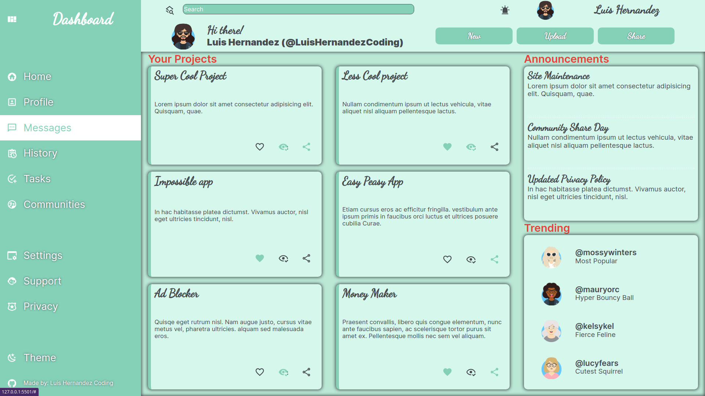

# Admin Dashboard Front End

In this project I will create a front end for an admin dashboard. I will use HTML5, CSS3 and JavaScript.
The main focus of this project is to ensure the knowledge of css grids

###### - Extra: its made with responsive approach in mind (test it on small screens)
###### - Extra: it includes Dark mode
###### - Extra: it includes Animated buttons

To check it out just go to this [Live Demo](https://luishernandezcoding.github.io/admin-dashboard-front-end/)

## Previews
> preview

> 
> preview Dark

> 

## The project

#### Definition

The project is a front end admin dashboard, made fully on css grids, using HTML, CSS and javascript only (no frameworks). The main idea is to practice CSS grids and to make a responsive design.

#### Features

The project has the following features:
- Responsive
- Dark mode toggle
- Animated buttons
- CSS Grids
- No frameworks or libraries

## Learning outcome

##### Learning Goals / Areas of Focus

- CSS Grids
- CSS Variables
- CSS Animations
- Responsive approach
- Dark mode
- Animated buttons

The project was a great opportunity to learn about css grids and the power of it. The project was also a good opportunity to learn about javascript and how to use it to create a dark mode and animated buttons.

##### Challenges

* Make the dashboard full responsive
* Add dark mode

## Built With

- VS Code
- HTML
- CSS
- Javascript
- Git flow
- Github

## Author

👤 **Luis Hernandez**

- GitHub: [@LuisHernandezCoding](